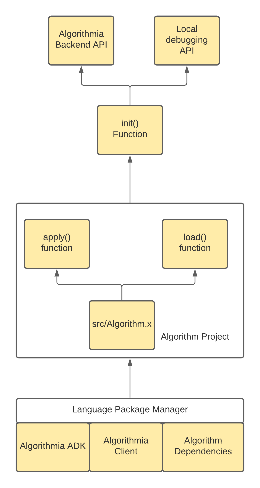

# Algorithm Development Kit (ADK), Java edition

<!-- embedme examples/hello_world/src/Algorithm.java -->
```java
```
## Focus
This document will describe the following:
- What is an Algorithm Development Kit
- Changes to Algorithm development
- Example workflows you can use to create your own Algorithms.


## What is an Algorithm Development Kit
An Algorithm Development Kit is a package that contains all of the necessary components to convert a regular application into one that can be executed and run on Algorithmia.
To do that, an ADK must be able to communicate with [langserver](https://github.com/algorithmiaio/langpacks/blob/develop/langpack_guide.md).
To keep things simple, an ADK exposes some optional functions, along with an `apply` function that acts as the explicit entrypoint into your algorithm.
Along with those basics, the ADK also exposes the ability to execute your algorithm locally, without `langserver`; which enables better debuggability.



This kit, when implemented by an algorithm developer - enables an easy way to get started with your project, along with well defined hooks to integrate with an existing project.


## Changes to Algorithm Development

Algorithm development does change with this introduction:
- An additional import (`import com.algorithmia.development.*;`)
- An AbstractAlgorithm class to extend, which contains two functions to implement, `apply` and (optionally) `load`.
- Finally, your algorithm is now executed directly instead of being a library, make sure to add the following at the bottom of your Algorithm.py file.
  ```java
  public static void main(String[] args) {
  Algorithm algorithm = new Algorithm();
  Handler algo = new Handler<>(algorithm);
  algo.init();
  }
  ```
    - Now your algorithm is Executable, rather than just a library
        - Which will interact with the `langserver` service on Algorithmia
        - But is debuggable via stdin/stdout when executed locally / outside of an Algorithm container
            - When a payload is provided to `init()`, that payload will be directly provided to your algorithm when executed locally, bypassing stdin parsing and simplifying debugging!
        - This includes being able to step through your algorithm code in your IDE of choice! Just execute your `src/Algorithm.java` script and try stepping through your code with your favorite IDE

## Example workflows
Check out these examples to help you get started:
### [hello world example](examples/hello_world)
  <!-- embedme examples/hello_world/src/Algorithm.java -->
```python
```


## Readme publishing
To compile the template readme, please check out [embedme](https://github.com/zakhenry/embedme) utility
and run the following:
```commandline
npm install -g npx
npx embedme --stdout README_template.md > README.md
```

## To publish a new version
First, deploy locally on the Algorithmia Deep Purple worker using the following:
`sbt publishM2`
then, load into an environment and validate functionality using the [Environment Validator](https://github.com/algorithmiaio/langpacks/tree/develop/tools)
After tests are complete, merge PR into master and let the automatic CI/CD system deploy the new version to maven.

and you're done :)